<!-- Developed by ::> Gehan Fernando -->
<div align="center">


# Audio8D — FFmpeg 8D Audio Converter for Windows and Linux

### 🎧 A Python desktop and command-line tool for creating customizable headphone-focused 8D audio.

**Developed by Gehan Fernando**

<p>


<a href="LICENSE"></a>

</p>
<p>


</p>

**[🚀 Quick start](#quick-start)** ·
**[🎵 Your first song](#your-first-song-the-window)** ·
**[⌨️ Command line](#command-line)** ·
**[🛠️ Troubleshooting](#troubleshooting)**

</div>

**Audio8D turns normal music into a moving 3D headphone experience.** Add a song,
choose how you want it to sound, listen to a preview, and create the new audio file.
People call this effect **"8D audio"**: the music seems to travel past one ear, behind
you, past the other ear and back.

- 🛡️ **Your songs are safe.** Audio8D always makes a **new** file. Your original song is
  not changed (unless you ask it to replace the original).
- 📦 **Nothing else to install.** The ready-made packages include everything Audio8D
  needs, including Python and FFmpeg (the sound program that does the work).
- 🔁 **There is a window and a command line.** Both do the same job, with the same
  features (see [Window or command line](#window-or-command-line)).

> [!IMPORTANT]
> 🎧 **Use headphones or earbuds.** The effect works because each ear hears something
> a little different. On speakers it sounds much weaker (the **Speakers** style helps).

<p align="center">
  
</p>

---

<a id="contents"></a>

## 📑 Contents

<table>
<tr>
<td valign="top" width="50%">

**For everyone**

1. [What Audio8D does](#what-audio8d-does)
2. [How it works](#how-it-works)
3. [Quick start](#quick-start)
4. [Windows](#windows)
5. [Linux](#linux)
6. [macOS (not tested)](#macos-not-tested)
7. [Check that it works](#check-that-it-works)
8. [Your first song (the window)](#your-first-song-the-window)
9. [Using the window](#using-the-window)
10. [Window or command line](#window-or-command-line)
11. [Command line](#command-line)
12. [Troubleshooting](#troubleshooting)
13. [Reference](#reference)
14. [Known limitations](#known-limitations)

</td>
<td valign="top" width="50%">

**For developers**

15. [Running from source](#running-from-source)
16. [Building the packages](#building-the-packages)
17. [Tests and project layout](#tests-and-project-layout)
18. [Credits and licences](#credits-and-licences)

</td>
</tr>
</table>

---

<a id="what-audio8d-does"></a>

## ✨ What Audio8D does

<table>
<tr>
<td width="33%" valign="top">

### 🌀 3D movement

Turns normal music into 3D ("8D") audio that moves around your head.

</td>
<td width="33%" valign="top">

### 🎚️ 13 sound styles

Studio, Gentle, Front, Smooth, Groove and more, and you can make and edit your own.

</td>
<td width="33%" valign="top">

### 👂 Listen first

A **short preview** or an **A/B comparison** (original, then 8D) before anything is created.

</td>
</tr>
<tr>
<td valign="top">

### 🎛️ One song, your way

**Customize one song** (or several) without changing the others.

</td>
<td valign="top">

### 📂 Many songs at once

A whole folder, even hundreds of songs, up to 16 at the same time.

</td>
<td valign="top">

### 💾 Five formats

Saves as **MP3, FLAC, WAV, M4A or Opus**.

</td>
</tr>
<tr>
<td valign="top">

### 🔊 Even loudness

Makes every song **as loud as your other music** (or keeps its own loudness).

</td>
<td valign="top">

### 🎤 Singer in the middle

Can keep **the singer near the middle** with an optional add-on.

</td>
<td valign="top">

### 🖥️ Window + ⌨️ command line

The same features either way, for clicking or for scripts.

</td>
</tr>
</table>

Audio8D reads MP3, FLAC, WAV, M4A/AAC, OGG, Opus, WMA, AIFF, ALAC, APE, WavPack, MKA and
the sound of MP4/WEBM videos.

---

<a id="how-it-works"></a>

## 🔄 How it works

**Your journey** is four steps, in the window or on the command line:

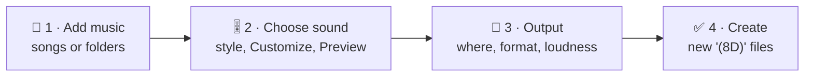
```mermaid
flowchart LR
    A["🎵 1 · Add music<br/>songs or folders"] --> B["🎚️ 2 · Choose sound<br/>style, Customize, Preview"]
    B --> C["💾 3 · Output<br/>where, format, loudness"]
    C --> D["✅ 4 · Create<br/>new '(8D)' files"]
```

**Inside, each song** goes through these stages (from `src/pipeline.py`):

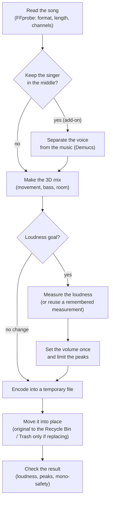
```mermaid
flowchart TD
    S["Read the song<br/>(FFprobe: format, length, channels)"] --> V{"Keep the singer<br/>in the middle?"}
    V -- "yes (add-on)" --> X["Separate the voice<br/>from the music (Demucs)"]
    V -- no --> M
    X --> M["Make the 3D mix<br/>(movement, bass, room)"]
    M --> L{"Loudness goal?"}
    L -- yes --> Q["Measure the loudness<br/>(or reuse a remembered measurement)"]
    Q --> G["Set the volume once<br/>and limit the peaks"]
    L -- "no change" --> E
    G --> E["Encode into a temporary file"]
    E --> P["Move it into place<br/>(original to the Recycle Bin / Trash only if replacing)"]
    P --> C["Check the result<br/>(loudness, peaks, mono-safety)"]
```

The details are in [How the sound is made](#how-the-sound-is-made).

---

<a id="quick-start"></a>

## 🚀 Quick start

1. **Choose the package for your computer:**

   | Your computer | Package | Status |
   |---|---|---|
   | 🪟 Windows 10 or 11 (64-bit) | `Audio8D-1.0.0-windows-x86_64.zip` (about 102 MB) | ✅ Tested |
   | 🐧 Linux (64-bit x86) | `Audio8D-1.0.0-linux-x86_64.zip` (about 82 MB) | ✅ Tested |
   | 🍎 Mac with Apple Silicon (M1 or newer) | `Audio8D-1.0.0-macos-arm64.zip` | ⚠️ **Not built or tested yet** |

2. **Get it.** The packages are in the **`bin`** folder of the Audio8D repository
   ([github.com/gcfernando/audio-8d/tree/main/bin](https://github.com/gcfernando/audio-8d/tree/main/bin)),
   or someone can give you a copy. There is no separate download page and no GitHub
   release. If the package for your system is not in `bin`, it hasn't been built yet (see
   [Building the packages](#building-the-packages)).
3. **Extract it.** You get an **`Audio8D`** folder (on Windows, inside a folder named
   like the ZIP, `Audio8D-1.0.0-windows-x86_64`).
4. **Run it:** double-click **`Audio8D.exe`** (Windows), **`Audio8D`** (Linux) or
   **`Audio8D.app`** (macOS; that package is not built or tested yet).

> [!NOTE]
> **You don't need Python or FFmpeg.** Each package already contains its own Python and
> FFmpeg, and ignores any Python on your computer. (Only the optional
> [singer add-on](#optional-add-on-keep-the-singer-in-the-middle) needs a Python.)

**What is in the `Audio8D` folder:**

| Windows | Linux | macOS | What it is |
|---|---|---|---|
| `Audio8D.exe` | `Audio8D` | `Audio8D.app` | The window |
| `audio8d-cli.exe` | `audio8d-cli` | `audio8d-cli` | The command line |
| `_internal` | `_internal` | (inside `Audio8D.app`) | Audio8D's own Python, libraries and FFmpeg; don't change it |
| `HOW TO RUN.txt`, `README.md`, `THIRD-PARTY-NOTICES.md`, `licenses` | same | same | Short instructions, this guide, licences |

> [!TIP]
> Keep the folder together; you can put it anywhere, including a path with spaces.

---

<a id="windows"></a>

## 🪟 Windows

Tested on Windows 11 Pro (64-bit): unpacked to a folder with spaces and run with Python and
FFmpeg hidden (only `C:\Windows\System32` on the PATH), also with a broken `PYTHONHOME`.

1. Right-click **`Audio8D-1.0.0-windows-x86_64.zip`** and choose **Extract All…**, then
   **Extract**.
2. Open the extracted **`Audio8D-1.0.0-windows-x86_64`** folder, then the **`Audio8D`**
   folder inside it, and double-click **`Audio8D.exe`**.
3. If Windows says *"Windows protected your PC"*, click **More info**, then **Run anyway**.
   This appears because the app is not signed with a paid certificate.

The command line is **`audio8d-cli.exe`** in the same folder: open the folder in File
Explorer, right-click an empty area, choose **Open in Terminal**, and type
`.\audio8d-cli.exe --check`.

---

<a id="linux"></a>

## 🐧 Linux

Tested on 64-bit x86 computers: Debian 12 and Fedora 40 with no Python and no FFmpeg, and
Ubuntu 24.04 (window shown). The package needs a **64-bit x86** computer with **glibc 2.35
or newer** (it was built on Ubuntu 22.04, which has glibc 2.35) and a desktop for the
window.

1. Extract the package with your file manager, or in a terminal:

   ```bash
   unzip Audio8D-1.0.0-linux-x86_64.zip
   ```

2. Open the **`Audio8D`** folder and double-click **`Audio8D`**, or run:

   ```bash
   ./Audio8D/Audio8D
   ```

3. If you see *Permission denied* (some extract tools drop the "may run" mark), run this
   once and try again:

   ```bash
   chmod +x Audio8D/Audio8D Audio8D/audio8d-cli
   ```

The command line is `./Audio8D/audio8d-cli` (for example `./Audio8D/audio8d-cli --check`).

> [!NOTE]
> **What is different on Linux:** there is no drag and drop into the window (use **Add
> songs** or **Add folder**, even though the window says *Drop songs or folders here*);
> previews open in your usual music player (this needs `xdg-open`, which desktops
> include); replaced originals go to the Trash.

---

<a id="macos-not-tested"></a>

## 🍎 macOS (not tested)

> [!CAUTION]
> The macOS package **has not been built or tested yet** (no Mac was available). These
> steps describe how it is designed to work. It is for Macs with **Apple Silicon** only.

1. Double-click **`Audio8D-1.0.0-macos-arm64.zip`**. You get an **`Audio8D`** folder.
2. Move **`Audio8D.app`** wherever you like (for example *Applications*).
3. The first time, **right-click `Audio8D.app` → Open**, then **Open** again (the app is not
   signed). If macOS says the app is damaged, run this in Terminal, in the folder with the
   app:

   ```bash
   xattr -dr com.apple.quarantine Audio8D.app
   ```

The command line is `./audio8d-cli` in the `Audio8D` folder (it runs the program inside
`Audio8D.app`). Keyboard shortcuts use **Ctrl**, not Cmd; there is no drag and drop into
the window; previews open in your usual music player; replaced originals go to the Trash.

---

<a id="check-that-it-works"></a>

## ✅ Check that it works

1. **The window:** it opens on *1 Add music*. **Settings → System check** shows FFmpeg and
   FFprobe as ready.
2. **The command line:** `--check` ends with **Everything required is ready.** (the
   singer add-on is optional) and shows where the log file is.
3. **A test song:** use any song you have. Listen to a short preview first, then make the
   8D song. It is saved as `<song> (8D).mp3` next to the original.

| System (terminal in the `Audio8D` folder) | Preview | Make the song |
|---|---|---|
| Windows | `.\audio8d-cli.exe "C:\Music\My Song.mp3" --preview` | `.\audio8d-cli.exe "C:\Music\My Song.mp3"` |
| Linux or macOS | `./audio8d-cli ~/Music/"My Song.mp3" --preview` | `./audio8d-cli ~/Music/"My Song.mp3"` |

The end of a successful run looks like this:

```text
  Created in 5.6 s  ->  C:\Music\Rain Study (8D).mp3  (3.6 MB)
  Loudness: measured -13.7 LUFS, turned down 0.3 dB  ->  -14.0 LUFS (checked)
  Check: -14.0 LUFS, peaks -3.1 dBTP, range 0.8 LU, mono-safe (correlation +0.87)
  Put on your headphones and press play!

  Tip: this used the studio style. Listen first with --preview   (every style: --list-styles)
```

> [!TIP]
> Running the same command again skips the song, because its 8D file already exists
> (*Nothing new to create*). Add `--overwrite` to make it again.

---

<a id="your-first-song-the-window"></a>

## 🎵 Your first song (the window)

This takes about five minutes. The four steps down the left side are the whole journey:
**1 Add music → 2 Choose sound → 3 Output → 4 Create.**

<p align="center">
  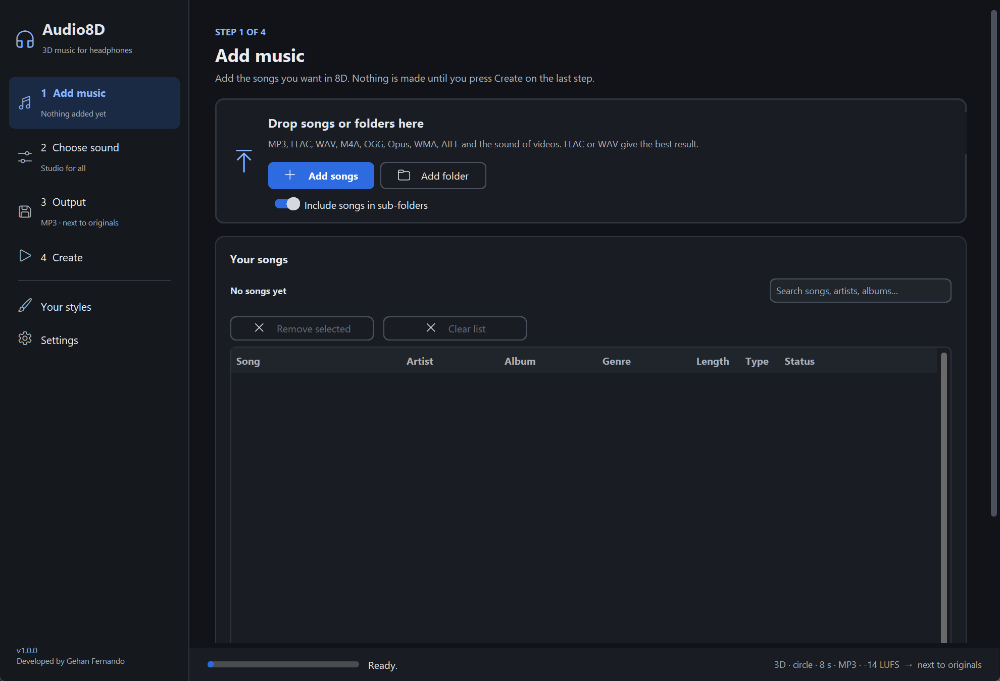
</p>

1. **Add your songs.** Click **Add songs** (one or more songs) or **Add folder** (every song
   in a folder; switch on *Include songs in sub-folders* to add those too). On Windows you
   can also **drag** songs or folders from File Explorer onto the window. A file that isn't
   music is shown in red and skipped. Click **Next: choose sound**.

   <p align="center">
     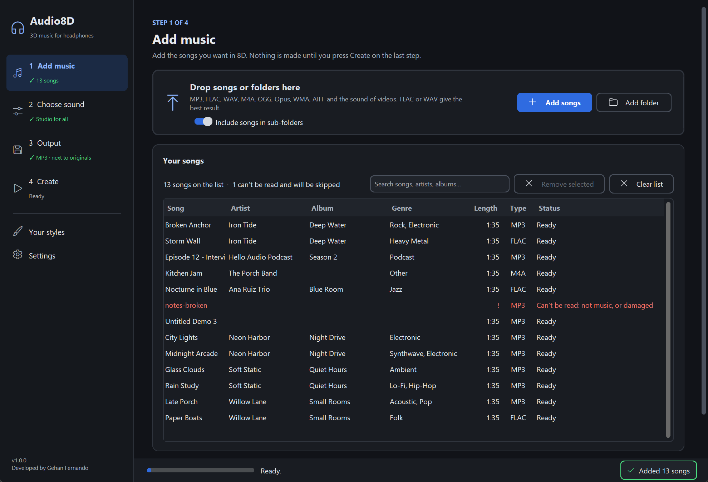
   </p>

2. **Choose a sound style.** **Studio** is already chosen and suits most music. To try
   another, click **Change style**, click a card, and click **Apply …** (the button names
   the style you picked).

   <p align="center">
     
   </p>

3. **Preview.** Select a song and click **Preview**. After a few seconds you hear about 30
   seconds from its loudest part. Nothing is kept. **Compare A/B** plays the same part
   twice: the original, then in 8D. (On macOS and Linux they open in your music player.)
   Click **Next: output**.

4. **Choose where and how to save** (step 3). The recommended choices are already selected,
   so you can simply go on. The main ones: where the new files go (*next to each original*
   or *in one folder you choose*), the **Output format** (MP3 works everywhere) and
   **Loudness** (*Match music apps*). Click **Next: create**.

5. **Create.** Step 4 shows a short summary. Click the big **Create N songs** button (it
   says how many). You see the progress and roughly how long is left; **Stop** stops after
   the current step and keeps finished songs.

   <p align="center">
     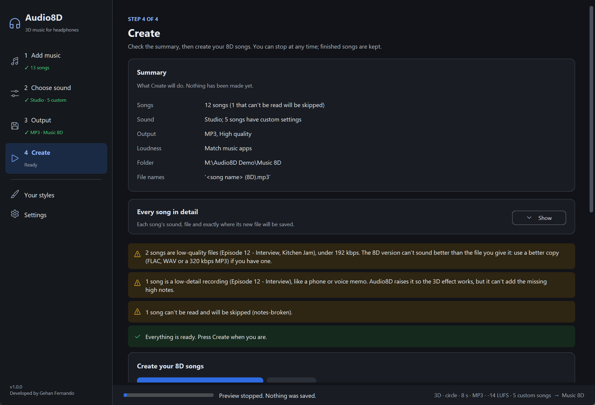
   </p>

6. **Find your new music.** Each new song is called **`<song name> (8D).mp3`**, next to the
   original song or in the folder you chose. Click **Open folder** to see them, or
   **Play** to listen.

   <p align="center">
     
   </p>

That's it. Put on your headphones and press play. 🎧

---

<a id="using-the-window"></a>

## 🖥️ Using the window

### Sound styles

A **style** is a ready-made way to make the music move. A style only changes **how it
sounds**; how the file is saved is chosen on step 3. If you don't know which to pick,
**start with Studio**.

**To change the style for all songs:** on step 2, click **Change style**, click a card,
listen with **Preview** if you like, then click **Apply** (or **Cancel**). Clicking a card
only selects it; nothing changes until you apply. The style in use is marked **✓ In use**,
the one you picked **● Selected**. Arrow keys move between cards, **Enter** applies,
**Esc** cancels.

| Style | What it sounds like | Good for |
|---|---|---|
| **Studio** ⭐ | Balanced movement around your head, with a touch of room | Most music, mixed playlists, or when you are unsure |
| **Gentle** | Soft, subtle movement that stays out of the way | Acoustic, folk and singer-songwriter music |
| **Front** | The music never goes behind you: it sways in front, like a pair of speakers | Jazz, classical and live recordings, long listening, or if circling distracts you |
| **Classic** | Audio8D's earlier 3D sound: like Studio, a touch stronger and roomier | Anyone who liked earlier versions of Audio8D |
| **Groove** | Loops around each ear, in time with the beat | Dance, electronic, hip-hop and pop |
| **Smooth** | Slow, relaxed movement | Lo-fi, chill and background music |
| **Strong** | Big, obvious movement with more room | Rock, metal and EDM (can tire your ears on long albums) |
| **Spacious** | Wide and airy, like a large room | Film music, ambient music and slow ballads |
| **Sky** | Drifts up over your head and back down | Ambient, chill-out and meditation music |
| **Voice** | For speech: a slow sweep in front of you with no room sound | Podcasts, audiobooks and spoken word |
| **Whirlwind** | A very fast spin: fun for a moment, but it may feel dizzying | Short clips and ringtones |
| **Speakers** | Gentle left-right movement that works without headphones | Speakers and car stereos |
| **Retro** | The old left-right "ping-pong" sound of the first Audio8D; the bass moves too | Nostalgia and short clips (not for long listening) |

No style is "better" than another; they suit different music. Every style was tested to
land near -14 LUFS without clipping. A preview uses the same processing as the final file;
it is only shorter, and the movement eases in over at most 1.5 s. A style preview uses the
all-songs output settings (see [Known limitations](#known-limitations)).

> [!WARNING]
> Fast spins (Whirlwind) can make some listeners feel they are turning; use them for
> short clips.

Audio8D can also **suggest** a style for each song from its genre: click **Use suggested
styles** on step 2 (it only changes songs where the genre makes the choice clear).

<details>
<summary><strong>Where the styles come from</strong> (standards and practice behind them)</summary>

#### Where the styles come from

The styles are Audio8D's own ready-made settings, **not an industry standard**. No
international standard defines a list of consumer "sound styles", and other 8D apps'
preset names are not standards either.

| Kind | What Audio8D uses |
|---|---|
| **Formal standards** | Loudness is measured with FFmpeg's meter, which follows ITU-R BS.1770 and EBU R 128. Lossy files aim to keep true peaks below -1 dBTP, the headroom AES TD1008 recommends before lossy encoding (measured for MP3 and Opus; M4A was not measured); FLAC and WAV keep sample peaks under -1 dBFS. |
| **Established practice** | Bass below 120 Hz stays in the middle (as in loudspeaker bass management); direction comes from the timing and level differences between your ears; a modest room helps the sound feel outside your head; Front stays within about the ±30° of a normal pair of stereo speakers (ITU-R BS.775). |
| **Audio8D's own choices** | The speed, depth, path and room of each style, chosen by listening and measurement. |

Standards for full immersive audio (ITU-R BS.2051 / BS.2127, MPEG-H 3D Audio, MPEG-I
Immersive Audio) describe complete speaker, object and head-tracking systems. Audio8D makes
ordinary stereo files for headphones; it does not implement those systems and claims no
compliance with them.

</details>

### Change how one song sounds (Customize)

Every song follows the default style unless you **customize** it.

1. On step 2, select the song and click **Customize…** (or double-click the song, or click
   **✎ Customize** in its row).
2. The **Customize "song name"** window opens; its title says which song you are changing.
3. Change what you like, then click **Apply**. **Cancel** (or **Esc**) changes nothing.

<p align="center">
  
</p>

| Choice | What you hear |
|---|---|
| **Style** | The ready-made sound the song starts from |
| **Movement**: Gentle, Balanced, Strong | How far the music travels around your head |
| **Speed**: Slow, Normal, Fast | How quickly the music goes once around you |
| **Space**: Dry, Natural, Spacious | How big the room around the music sounds |
| **Keep bass centered** | The drums and bass stay steady in the middle (recommended) |
| **Keep the singer in the middle** | The music moves; the voice moves only a little and stays close to the middle (needs the [add-on](#optional-add-on-keep-the-singer-in-the-middle)) |

Click **Preview** in the dialog to hear your changes **before** you apply them. If a
style uses a value between two choices, no choice is highlighted and the line under it
says so.

**Save this song differently** (folded) gives this song its own file format, quality,
loudness, or only part of the song. **Advanced** (folded) holds the exact numbers behind
the choices, plus path, direction, height, easing, beat sync, speed and movement over
time, and *Safe for speakers too*; you never need them.

<p align="center">
  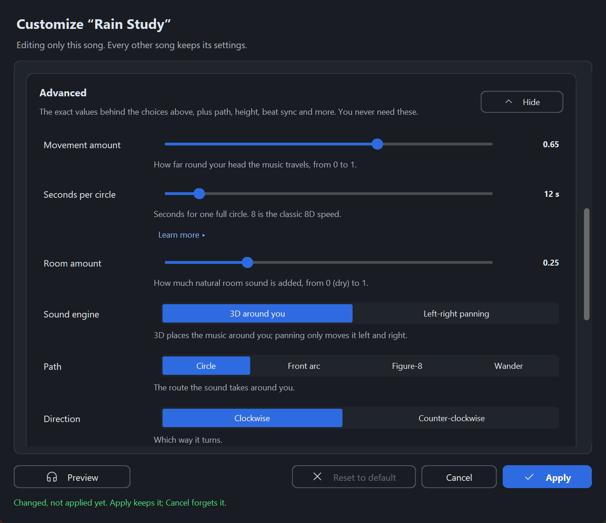
</p>

**Several songs at once:** select them (Shift+click or Ctrl+click) and click **Customize 2
songs…**. Only what you change is applied to all of them.

<p align="center">
  
</p>

**The default sound for every song:** click **Customize default…** under **Change
style**. The dialog says *Editing defaults for all songs*; songs you customized keep their
own settings.

### Default and Custom

Audio8D starts with **one set of default settings**. Every song uses them **unless you
customize that song**. The **Settings** column in the song list says which:

| Word | Meaning |
|---|---|
| **Default** | This song follows the main settings. |
| **Custom** | This song has its own settings. |

<p align="center">
  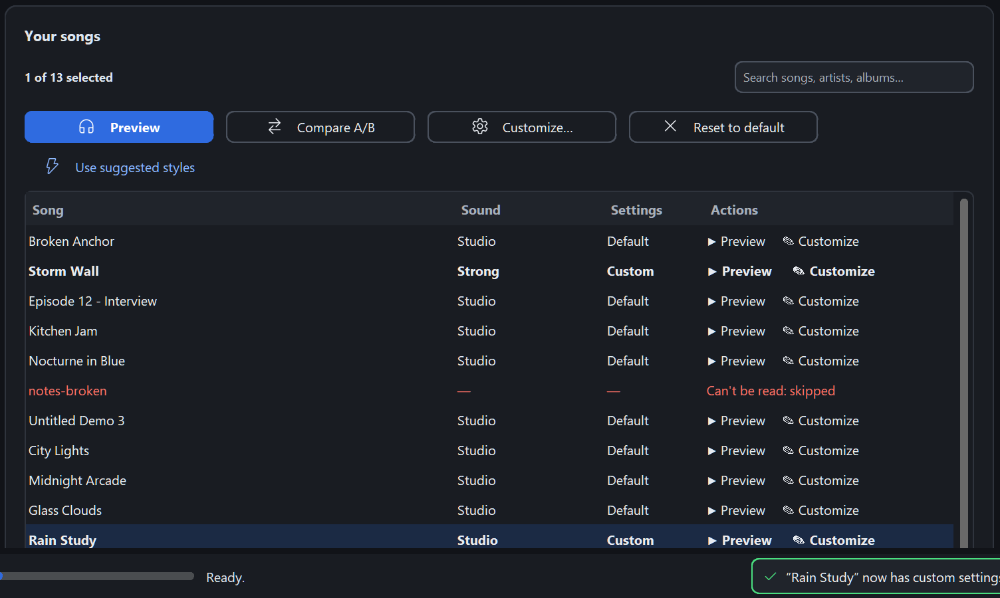
</p>

**Example.** You change the default style to **Smooth**. Every *Default* song now sounds
Smooth. A song you had customized to **Strong** stays Strong. Songs you add later follow
the default.

**Reset to default** removes a song's own settings. Select the song(s) on step 2 and click
**Reset to default**, or click **Reset to default** inside **Customize**.

### Preview your music

**Preview** lets you listen before creating anything.

- It makes only a **short temporary** piece of audio (30 seconds by default, from the
  loudest part; change it in **Settings → Preview length**: 15, 30, 45 or 60 s). It is
  never saved next to your music, and it is cleaned up automatically.
- **Compare A/B** (next to **Preview** on step 2) plays the same part of the selected song
  twice: first the original (A), then in 8D (B), at the same loudness. Nothing is saved.
- **On Windows** the preview plays inside Audio8D and the button shows what it will do:
  **▶ Preview** (click to listen), **◌ Preparing… 40%** (click to cancel), **■ Stop**
  (click to stop).
- **On macOS and Linux** the preview opens in your usual music player when it is ready;
  stop it in that player.
- Starting another preview replaces the current one. A song you already previewed with the
  same settings plays again straight away.
- Inside **Change style** and **Customize**, **Preview** plays the style or changes you are
  looking at, **without applying them**.
- To **save** a permanent file, use **Create** (step 4).

<p align="center">
  
</p>

<p align="center">
  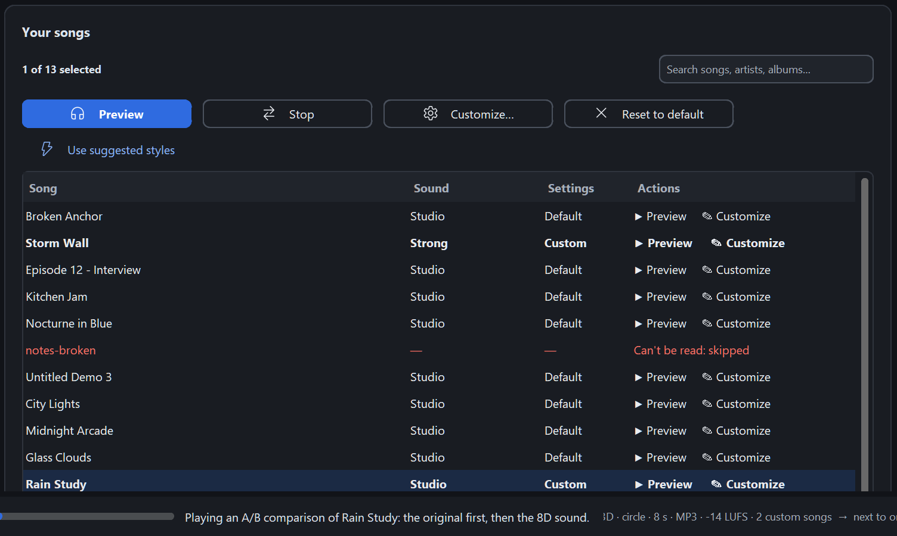
</p>

### Where the new files go

Step 3 starts with **Where the new files go (all songs)**:

- **Save them**: *Next to each original* (the default) or *In one folder I choose*
  (**Browse…**);
- **File names**: *'Song (8D)'* (recommended), *Same as the original* (needs a folder), or
  *Custom…* (one song only);
- **If the 8D file exists**: *Skip that song* (running again only makes what's missing) or
  *Replace it*;
- **Original songs**: *Keep them* (the default), *Replace them*, or *Replace, keep '(8D)'*.
  A replaced original goes to the **Recycle Bin** on Windows or the **Trash** on macOS and
  Linux, so you can get it back. On Windows, on a drive without a Recycle Bin, it is kept,
  renamed *"… (original)"*.

<p align="center">
  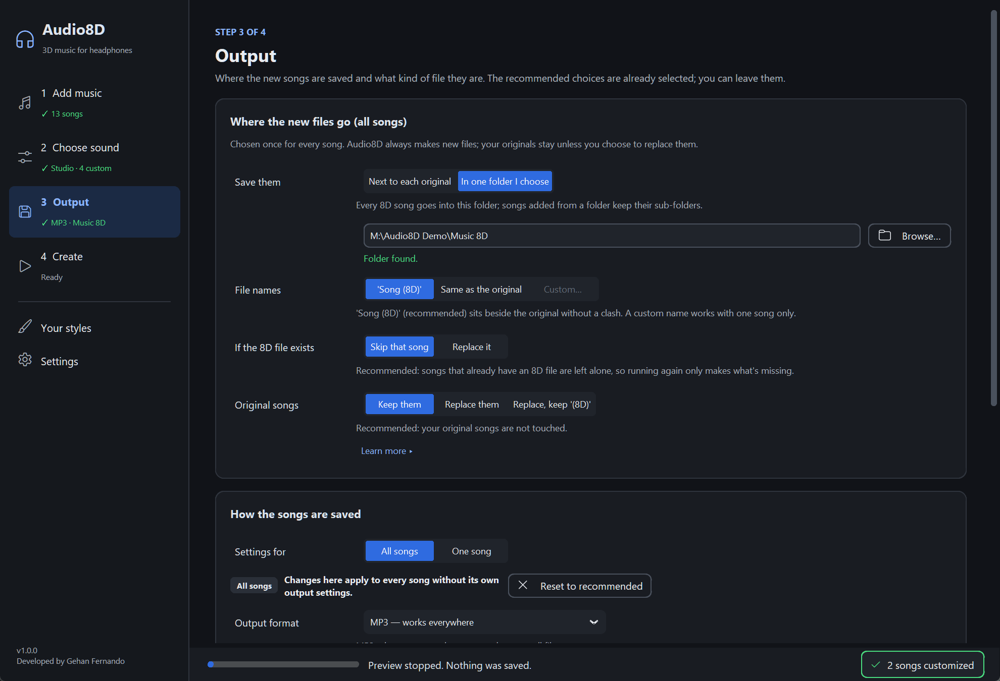
</p>

### All songs or one song

The next card, *How the songs are saved*, starts with **Settings for: All songs | One
song**. Everything in that card, including **More output options**, follows this choice.

- **All songs** (where it starts): *Changes here apply to every song without its own
  output settings*, including songs you add later. **Reset to recommended** puts these
  back to MP3, High quality, Match music apps; songs with their own settings keep them.
- **One song**: a **Song** list appears, set to the song selected on step 2 (pick another
  in the **Song** list). The line says *Changes here apply to "Glass Clouds" only*, with a
  **Default** or **Custom** badge. **Reset to default** removes only that song's own output
  settings; its sound (step 2) is not touched.

<p align="center">
  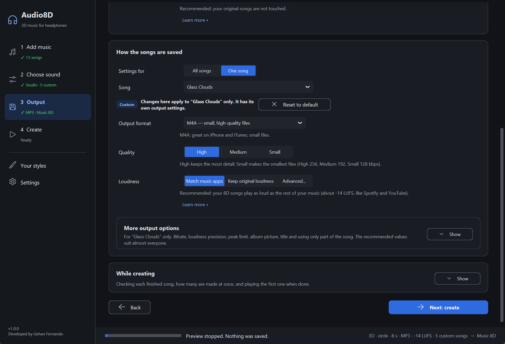
</p>

Changing an **All songs** setting never changes a song's own choice (change the default to
Opus, and a song you set to M4A stays M4A). A choice equal to the default doesn't make a
song Custom. The same per-song settings are also under **Customize → Save this song
differently** on step 2.

> [!NOTE]
> Audio8D remembers the output defaults, the default style and the preview length for
> next time. It never remembers *Replace them* or *Replace it*, and a song's own settings
> last only while that song is on the list.

### Choosing a file format

| Format | Choose it when | Good to know |
|---|---|---|
| **MP3** (default) | You want a file that works almost everywhere | Phones, cars, every music app |
| **FLAC** | You want lossless quality: nothing is thrown away | About 4 times bigger than MP3; most, but not all, players |
| **WAV** | You want an uncompressed audio file | Very big files; no album picture |
| **M4A** | You want good quality with smaller files | Great on iPhone and in iTunes |
| **Opus** | You want efficient modern compression | The smallest files; some older players can't open it |

**Quality** (MP3, M4A and Opus) is **High** by default: MP3 320 kbps, M4A 256 kbps, Opus
192 kbps. *Medium* and *Small* make smaller files. FLAC and WAV are lossless, so they have
no quality to choose. A higher bitrate or FLAC keeps more of what the song has, but can't
bring back detail a compressed source (such as a 128 kbps MP3) never had.

**More output options** (click **Show**) holds the rest, showing only what applies:

- **Bitrate (kbps)**: the exact rate behind Quality (Auto, 128 to 320); not for FLAC/WAV.
  With MP3 and *Auto*, **MP3 variable quality** (V0 best to V9 smallest) appears;
- **Get as close to the loudness as possible**: off (recommended) never squeezes the
  loudest moments, so a very dynamic song may end a little quieter. On shaves the loudest
  peaks to get as close to the target as possible; very loud or punchy songs can still
  land a little under it;
- **Peak limit**: the loudest a peak may get, set in **dB from -24 to 0** (half-dB steps);
  recommended -1.5 dB for MP3, M4A and Opus, -1.0 dB for FLAC and WAV;
- **Keep the album picture** and **Add ' (8D)' to the song title**;
- **Use only part: from / to**: times like 90 or 1:30, for example for a ringtone.

<p align="center">
  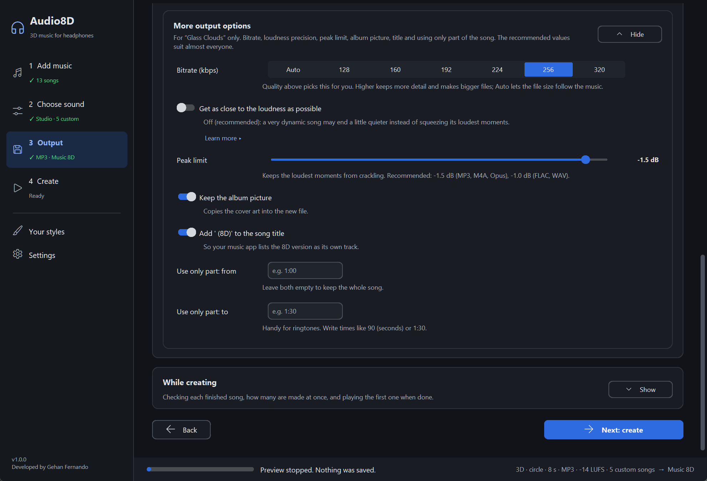
</p>

**While creating** (folded, for all songs) holds **Check each finished song** (measures
loudness and peaks; recommended on), **Songs at once** (1 to 16; a good value for your
computer is already set) and **Play the first song when finished**.

### Loudness

Songs from different albums are often not equally loud. Audio8D can fix that.

- **Match music apps** (default): your new songs play at about the same volume as music
  from Spotify, YouTube and other apps. *(Technical target: -14 LUFS.)*
- **Keep original loudness:** each new song is as loud as its original was.
- **Advanced…** shows *Apple Music (-16)*, *TV & radio (-23)*, *No change* (no adjustment;
  8D songs are then often a little quieter) and *Custom…* (a level from -30 to -5).

Loudness is **measured**, never guessed, and the loudest peaks are protected so nothing
crackles. **LUFS** is simply the unit for how loud music feels.

On the command line, each result shows the finished file's measured loudness, marked
*(checked)*, with a yellow note when a song lands more than 0.5 LU under the target. With
`--no-check` nothing is measured afterwards, so it says what the song *aims for*.

### Create your songs

Step 4 · **Create** shows a **Summary** and, folded, **Every song in detail** (each song's
sound, file and exactly where its new file will be saved), then anything that must be
fixed first (red) or is worth knowing (yellow). When everything is fine you see
*Everything is ready*.

Click **Create N songs**. While it works, the bar shows *4 of 12 done · now: Nocturne in
Blue · about 0:21 left*, and each song's row says what it is doing, then **Done**. **Stop**
stops after the current step; finished songs are kept and the unfinished one is cleaned up.
**Esc** asks first (*Stop creating?* → **Stop** or **Keep working**). You can keep using
the window.

<p align="center">
  
</p>

Afterwards: **Play** plays the selected new song, **Open folder** opens its folder, **Show
only songs with a problem** filters the list, **Copy problem list** copies the problems,
and **Try failed songs again** retries only the songs that failed.

If a song's 8D file already exists, it is skipped. To make it again, choose **If the 8D
file exists: Replace it** on step 3.

### Optional add-on: keep the singer in the middle

<p align="center">
  
</p>

#### What is it?

An extra part called **Demucs**, a free AI model that separates a singer's voice from the
music, with **PyTorch**, the engine it runs on. It is not included because of its size.

#### What does it give me?

The option **Keep the singer in the middle**: the band moves around your head while the
voice moves only a little and stays close to the middle.

#### Do I need it?

**No.** Audio8D works fully without it. Only this one option needs it.

#### What changes on my computer?

Audio8D makes its **own add-on folder** and downloads Demucs and PyTorch into it, using a
Python that is already on your computer (3.10 or newer; on Windows use 64-bit Python).
**Nothing else is changed**: not your Python, not your other programs.

> [!WARNING]
> - **Download size:** about **1 GB on Windows**; on Linux PyTorch can be **several GB**.
> - It needs an internet connection and takes a few minutes or more.
> - On Linux, Python's venv module must be installed (`sudo apt install python3 python3-venv`).

| Windows | macOS | Linux |
|---|---|---|
| `%LOCALAPPDATA%\Audio8D\addon` | `~/Library/Application Support/Audio8D/addon` | `~/.local/share/audio8d/addon` |

#### How do I install it?

**Window:** **Settings** → the **Add-on** card → read the four boxes → **Install add-on** →
confirm. You can keep using Audio8D while it installs; **Stop** cancels it, and nothing
half-installed is kept. If no Python is found, the card says how to get one.

The card shows each step and, where it can be measured, a real percentage, for example
*Downloading packages — 42% · torch-….whl (12 of 31)* (files downloaded). Steps that can't
be measured show a moving bar with no number. **100%** appears only when it really worked
(*Installed successfully — 100%*); a failed or stopped install says where it stopped, for
example *(stopped at 42%)*. **Show details** lists pip's own output.

<p align="center">
  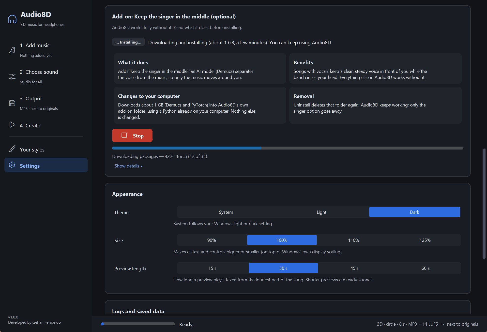
</p>

**Command line:** `audio8d --install-addon`

#### How do I check whether it is installed?

**Window:** Settings → Add-on shows **✓ Installed**, **○ Not installed**, or **Needs
repair**. **Command line:** `audio8d --addon-status` (exit code 0 = installed, 1 = not).

<p align="center">
  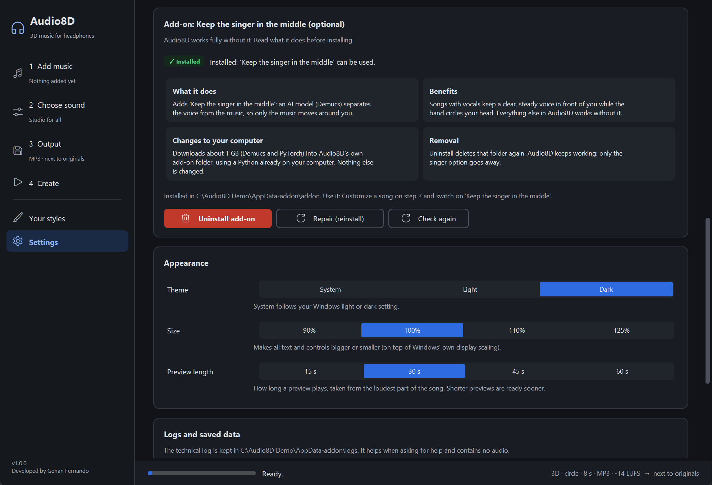
</p>

#### How do I use it?

Customize a song (step 2) and switch on **Keep the singer in the middle**. Command line:
`audio8d "My Song.mp3" --vocals center`. Each such song takes a minute or two longer.

#### How do I remove it?

**Window:** Settings → Add-on → **Uninstall add-on** → confirm. The card ends with
*Uninstalled successfully — 100%*. **Command line:** `audio8d --uninstall-addon`.

<p align="center">
  
</p>

**Repair (reinstall)** deletes the add-on folder and installs it again. Command line:
`audio8d --repair-addon`.

After uninstalling, Audio8D keeps working; only *Keep the singer in the middle* becomes
unavailable, and Audio8D tells you which songs used it. If you installed Demucs yourself
into your own Python, Audio8D uses it too but never removes it.

### Your own styles

On **Your styles** (left side) you can make a style by answering a few questions (music
type, movement, speed, space, headphones or speakers). Audio8D checks it, suggests a name
and a description, and **Try it** plays the selected song with it. You can also save your
current default sound as a style. Saved styles appear in **Change style** and
**Customize** like the built-in ones.

<p align="center">
  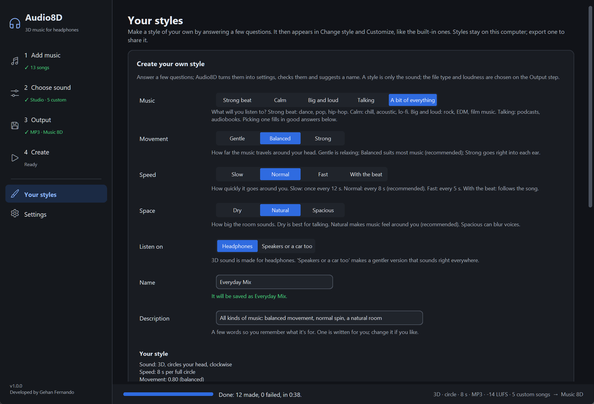
</p>

Each saved style has these buttons:

- **Use**: makes it the default style (songs you customized keep theirs);
- **Edit**: opens the style with a **Name** box. Change the sound (Movement, Speed, Space,
  the Optional and Advanced parts) and the name, listen with **Preview**, then click
  **Save changes**. The same style is updated; no copy is made. Songs that use it get the
  new sound at once. **Cancel** keeps the style as it was;
- **Rename**, **Duplicate**, **Export** (a small `.json` file to share) and **Delete**;
  **Import a style…** adds one from a file.

<p align="center">
  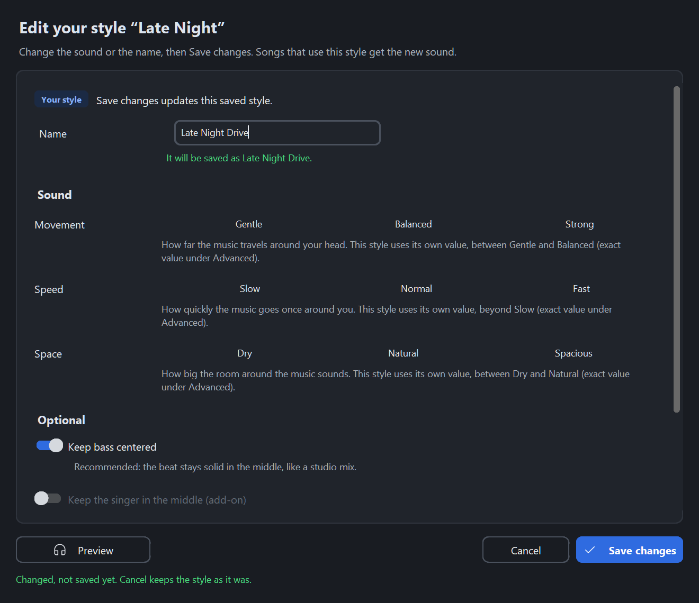
</p>

Every save checks the name (words starting with a capital, not taken, not a built-in name,
at most 40 characters) and the sound (a style with no movement is refused; a doubtful one
asks *Save as it is* or *Improve and save*). Built-in styles can't be edited or renamed;
save your current sound or duplicate one of your styles to start from it. A style is only a
sound: file format and loudness are never part of it. All of this also works on the
command line (see [Your own styles on the command line](#your-own-styles-on-the-command-line)).

### Settings, keyboard and getting help

**Settings** (left side) holds:

- the **System check**: every program Audio8D depends on, marked *Ready*, *Missing*,
  *Invalid*, *Optional* or *Unavailable*, with what to do; **Check everything again**
  re-runs it;
- **FFmpeg and FFprobe**: normally found automatically; **Browse…** chooses your own, and
  **Find automatically** goes back;
- the **Add-on** (see above);
- **Appearance**: **Theme** (Light, Dark or System), **Size** (text and controls), and
  **Preview length**;
- **Logs and saved data**: where the log is kept, **Show technical details** (writes
  every step into the log), **Open log folder**, **Delete saved log files**, and **Clear
  remembered data** (forgets the remembered loudness measurements and singer splits; they
  are made again when needed). Both deletes ask before anything is deleted;
- **About** with **Open the full guide** (this page).

<p align="center">
  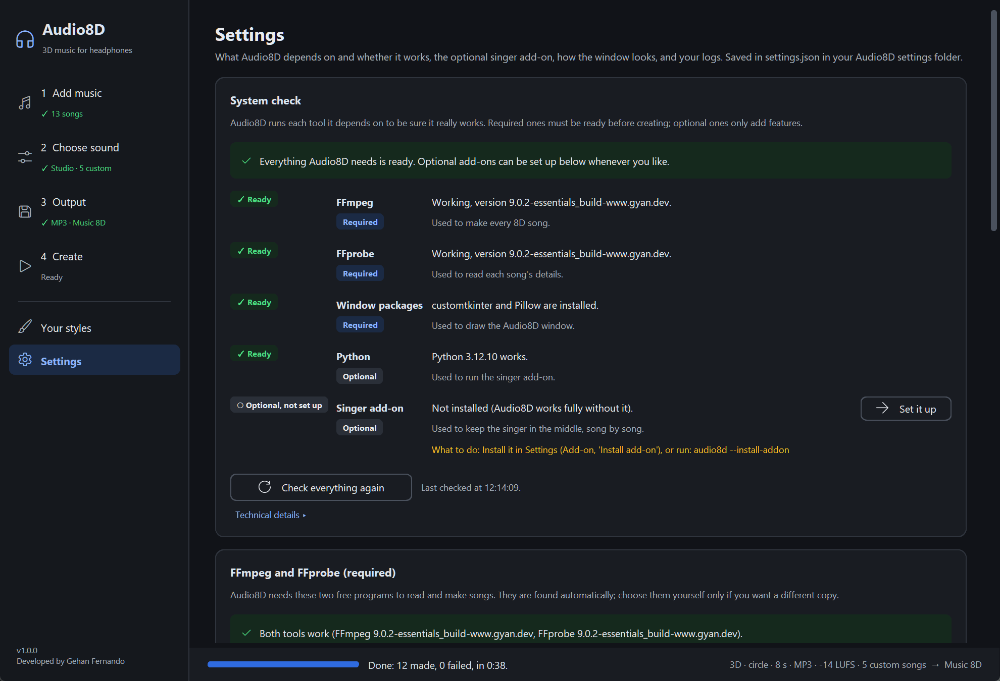
</p>
<p align="center">
  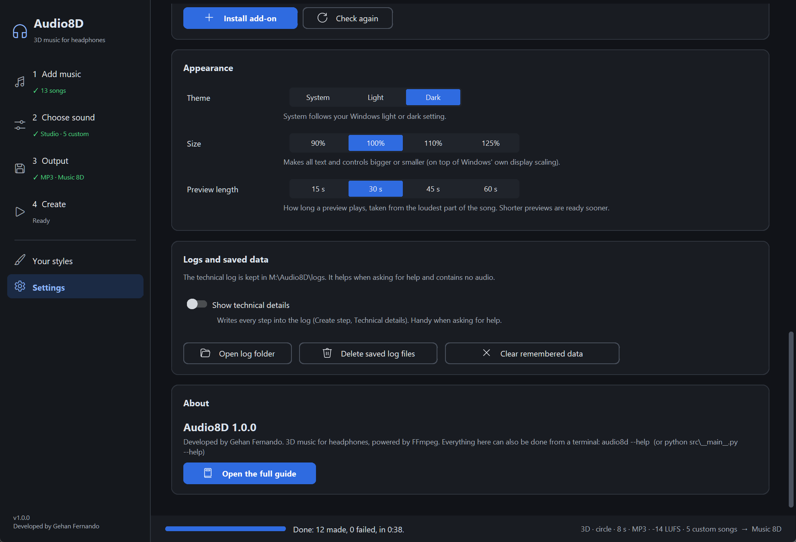
</p>

**Keyboard** (Ctrl on every system; on macOS too, not Cmd, though untested there):

| Keys | What they do |
|---|---|
| **Tab**, **Shift+Tab** | Move between buttons and choices (a ring shows where you are) |
| **Space**, **Enter** | Press the button or open the list |
| **←** **→** | Change a choice, e.g. Gentle / Balanced / Strong |
| **Ctrl+1** … **Ctrl+6** | Go to a step or page |
| **Ctrl+O**, **Ctrl+Shift+O** | Add songs, add a folder |
| **Ctrl+P** | Preview (or stop) the selected song |
| **Ctrl+Enter** | Create |
| **Ctrl+F** | Search the song list |
| **Enter** / **Space** (in the song list) | Customize / preview the selected song |
| **Esc** | Close a dialog without changing anything; otherwise stop a preview, or, while creating, ask *Stop creating?* |

**When something goes wrong,** Audio8D says what happened in plain words and what to do.
The technical details are under **Show details**; **Copy details** copies them for someone
helping you.

<p align="center">
  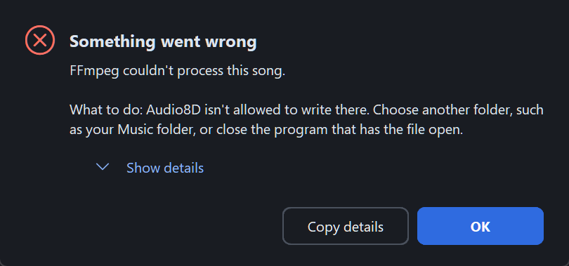
</p>
<p align="center">
  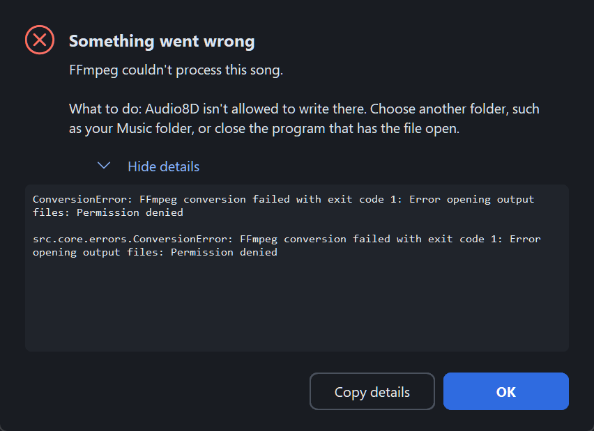
</p>

---

<a id="window-or-command-line"></a>

## 🔁 Window or command line

The window and the command line offer **the same features** and share the same rules, the
same styles and the same Settings (FFmpeg, Python, your styles). Use whichever you like.

<details>
<summary><strong>Which window control matches which command-line option</strong></summary>

| In the window | On the command line |
|---|---|
| **Add songs**, **Add folder**, drag and drop | Songs and folders after the command, as many as you like |
| *Include songs in sub-folders* | `--recursive` |
| **Change style** | `--style NAME` (`--list-styles` shows them all) |
| **Use suggested styles** | `--suggest` (shows the suggestion for each song) |
| Customize: **Movement**, **Speed**, **Space** | `--movement`, `--speed`, `--space` |
| Customize → Advanced: **Movement amount**, **Seconds per circle**, **Room amount** | `--intensity`, `--rotation-seconds`, `--ambience` |
| **Sound engine**, **Path**, **Direction** | `--engine`, `--path`, `--direction` |
| **Keep bass centered** / **Bass centered below** | `--bass HZ` or `--bass off` |
| **Height**, **Ease in and out** | `--elevation`, `--fade` |
| **Spin in time with the beat**, **Tempo** | `--beat-sync` / `--no-beat-sync`, `--bpm TEMPO` / `--bpm off` |
| **Speed over time**, **Movement over time** | `--speed-curve`, `--intensity-curve` (`off` for none) |
| **Safe for speakers too** | `--speakers` / `--no-speakers` |
| **Keep the singer in the middle** | `--vocals center` |
| **Customize** one song, **Save this song differently** | A line in a `--per-song` file |
| **Reset to default** | `--default` on a `--per-song` line |
| **Preview**, **Compare A/B** | `--preview [SECONDS]`, `--compare` |
| Settings → **Preview length** (15–60 s) | `--preview SECONDS` (5–120 s) |
| **Save them**: *In one folder I choose* | `--output-dir FOLDER` |
| **File names**: *'Song (8D)'* / *Same as the original* / *Custom…* | `--name 8d` / `--name original` / an output name after the song |
| **If the 8D file exists**: *Replace it* | `--overwrite` |
| **Original songs**: *Replace them* / *Replace, keep '(8D)'* | `--replace` / `--replace --name 8d` |
| **Output format**, **Quality**, **Loudness** | `--format`, `--bitrate`, `--loudness` |
| **Bitrate**, **MP3 variable quality** | `--bitrate KBPS` or `--bitrate auto`, `--quality 0..9` |
| **Get as close to the loudness as possible** | `--exact-loudness` / `--no-exact-loudness` |
| **Peak limit** (dB) | `--limiter-ceiling` (as a fraction: -1.5 dB ≈ 0.84) |
| **Keep the album picture**, **Add ' (8D)' to the song title** | `--cover` / `--no-cover`, `--title-tag` / `--keep-title` |
| **Use only part: from / to** | `--start TIME`, `--end TIME` (`off` for none) |
| **Check each finished song** (off) | `--no-check` |
| **Songs at once** | `--jobs N` (1–16) |
| **Play the first song when finished** | `--play` |
| Step 4 **Summary** | `--dry-run` |
| **Your styles**: save, **Edit**, **Rename**, **Duplicate**, **Delete**, **Export**, **Import a style…** | `--save-style`, `--update-style`, `--rename-style`, `--duplicate-style`, `--delete-style`, `--export-style`, `--import-style` (with `--style-description`) |
| Settings → **System check** | `--check` |
| Settings → **FFmpeg and FFprobe** | `--ffmpeg PATH`, `--ffprobe PATH` (for one run) |
| Settings → **Add-on** | `--addon-status`, `--install-addon`, `--repair-addon`, `--uninstall-addon`, `--python PATH` |
| **Show technical details** | `--verbose` |
| **Delete saved log files**, **Clear remembered data** | `--delete-logs`, `--clear-cache` |

</details>

A few things only make sense on one side:

- **Only in the window:** the theme and size, drag and drop, opening this guide in your
  browser, and **Open folder** / **Play** after creating.
- **Only on the command line:** the **step-by-step helper** you get by typing the command
  alone.

---

<a id="command-line"></a>

## ⌨️ Command line

Everything the window does can also be done by **typing commands**, handy for many songs
or for scripts.

**How to start it:**

| You have | Type (in a terminal) |
|---|---|
| The Windows package | `.\audio8d-cli.exe` (in the `Audio8D` folder) |
| The Linux or macOS package | `./audio8d-cli` (in the `Audio8D` folder) |
| The source code (developers) | `python src\__main__.py` or `python src/__main__.py` (in the `audio-8d` folder, venv on) |

The examples below write **`audio8d`**; replace it with the line that fits you. Put names
with spaces in **"quotes"**. Typing the command alone starts a **step-by-step helper**
that asks you a few questions.

### Make songs

```powershell
audio8d "My Song.mp3"
audio8d "C:\Music" --output-dir "C:\Music 8D"
audio8d "C:\Music" --recursive --output-dir "C:\Music 8D" --jobs 4
audio8d "a.mp3" "b.flac" "C:\Music"
```

One song gives **`My Song (8D).mp3`** next to the original (Studio style, MP3 High
quality, as loud as music apps). With a folder, `--recursive` also takes songs from
sub-folders and `--jobs 4` makes 4 songs at once (1 to 16).

**Several songs and folders in one run:** list them all; they are made together like one
folder. Songs that would get the same new name (for example `Intro.mp3` from two
folders, saved into one `--output-dir`) get **" (2)"**, **" (3)"** … instead of one
replacing the other: `Intro (8D).mp3` and `Intro (8D) (2).mp3`. (With just two names, the second counts as a song to make only when
it is a folder or `--output-dir` is given; otherwise it is the output name.)

> [!NOTE]
> **An 8D file that already exists is skipped**, for one song as for a folder: Audio8D
> says *Nothing new to create* and ends with exit code 0. Add `--overwrite` to make it
> again.

**Look before you make:**

```powershell
audio8d "C:\Music" --dry-run
audio8d "C:\Music" --suggest
```

`--dry-run` shows the settings and where each new song would be saved, then stops without
making anything. `--suggest` shows the style that suits each song best (from its tags),
then stops.

### Choose the sound

```powershell
audio8d "My Song.mp3" --style smooth
audio8d --list-styles
audio8d "My Song.mp3" --movement gentle --speed slow --space spacious
audio8d "My Song.mp3" --speed-curve "0=10, 1:00=6, 2:30=10"
```

`--list-styles` shows every style with its exact values (yours included). Exact values
also work (`--intensity`, `--rotation-seconds`, `--ambience`); don't give a word and its
exact value together.

**Switching a style's setting off:** several options have an "off" form, so you can undo
what a style (or the command line, in a `--per-song` file) switched on:

| Option | "Off" form |
|---|---|
| `--beat-sync` | `--no-beat-sync` (even when the style has beat sync on) |
| `--bpm TEMPO` | `--bpm off` (let Audio8D find the tempo) |
| `--speed-curve`, `--intensity-curve` | `--speed-curve off`, `--intensity-curve off` (the same all the way through) |
| `--speakers` | `--no-speakers` (made for headphones only, the normal) |

Curve times can have fractions of a second (for example `1:30.5=6`), and they are kept
exactly.

### Choose how it is saved

```powershell
audio8d "My Song.mp3" --format flac
audio8d "My Song.mp3" --format m4a --bitrate 192
audio8d "My Song.mp3" --loudness match
audio8d "My Song.mp3" --loudness -16
audio8d "My Song.mp3" --start 1:30 --end 2:00 --format m4a
```

Formats: `mp3` (default), `flac`, `wav`, `m4a`, `opus`. Loudness: `-14` is *Match music
apps* (default), `match` is *Keep original loudness*, `off` means no change; any number
from -30 to -5 also works.

Like the window's switches, these have both sides: `--exact-loudness` /
`--no-exact-loudness`, `--no-cover` / `--cover`, `--keep-title` / `--title-tag`, and
`--start off` / `--end off` (from the very start / to the very end).

### Listen first

```powershell
audio8d "My Song.mp3" --preview
audio8d "My Song.mp3" --preview 15
audio8d "My Song.mp3" --compare
```

`--preview` makes a short sample (30 seconds, or the number you give, from 5 to 120) in a
temporary folder, plays it and deletes it afterwards (on Windows press Enter or Ctrl+C to
stop early; on macOS and Linux it opens in your music player). `--compare` plays the
original, then the 8D version, at the same loudness. To keep a sample, name the file:
`audio8d "My Song.mp3" "sample.wav" --preview 20`.

### Give some songs their own settings

For a folder, a small text file gives some songs their own settings (**one song per
line**, then the same options you would type):

```text
# song               its own settings
"Rain Study.mp3"     --style smooth --format flac
*.mp3                --loudness match
"Glass Clouds"       --default
"Storm Wall.flac"    --no-beat-sync --no-speakers --start off
```

```powershell
audio8d "C:\Music" --per-song songs.txt
```

- The options on the command itself are the defaults; a line is one song's override.
- A line names a song by its file name, its name without the extension, a pattern
  (`*.flac`) or a path. Every matching line applies, top to bottom.
- **`--default`** on a line is **Reset to default** for that song.
- The "off" forms (`--no-beat-sync`, `--no-exact-loudness`, `--speed-curve off`,
  `--intensity-curve off`, `--bpm off`, `--no-speakers`, `--cover`, `--title-tag`,
  `--start off`, `--end off`) undo, for that song, what the command line switched on.
- Settings for the whole run (`--output-dir`, `--jobs`…) can't go on a line.

### Your own styles on the command line

```powershell
audio8d --movement gentle --speed slow --save-style "Late Night" --style-description "Calm evenings"
audio8d --space spacious --update-style "Late Night"
audio8d --rename-style "Late Night" "Late Night Drive"
audio8d --duplicate-style "Late Night Drive" "Sunday Drive"
audio8d --export-style "Sunday Drive" sunday.json
audio8d --import-style sunday.json "Shared Drive"
audio8d --delete-style "Shared Drive"
```

- `--save-style NAME` saves the sound settings you typed as a new style; use it later with
  `--style NAME`. It saves only the sound: not the speakers switch, the file format or the
  loudness.
- `--update-style NAME` saves the settings into one of your saved styles (it starts from
  that style unless you add `--style`); `--style-description TEXT` adds a few words to
  either.
- `--rename-style`, `--duplicate-style`, `--delete-style`, `--export-style` and
  `--import-style` (optionally under a new name) do the same as the buttons on **Your
  styles**, then stop. Deleting a style never touches songs already made.
- The same name and sound checks as in the window apply.

### The add-on, checks and help

```powershell
audio8d --addon-status
audio8d --install-addon
audio8d --repair-addon
audio8d --uninstall-addon
audio8d "My Song.mp3" --vocals center
audio8d --check
audio8d --clear-cache
audio8d --delete-logs
audio8d --help
audio8d --version
```

- `--addon-status` explains the add-on (exit code 0 = installed, 1 = not).
  Installing, repairing and uninstalling show the same steps and real percentages as the
  window. `--python PATH` chooses the Python used to install it.
- `--check` runs every program Audio8D needs, says what to fix (exit code 0 = ready) and
  shows where the log file is. Add `--verbose` for technical details.
- `--clear-cache` forgets the remembered loudness measurements and singer splits (they
  are made again when needed); `--delete-logs` deletes the saved log files.
- **Exit codes:** 0 = done (also when every song was already made); 1 = a problem was
  explained (for example a song failed); 2 = the command itself was mistyped.

The command line uses the FFmpeg, Python and styles you chose in the window's Settings.

### All options

<details open>
<summary><strong>Every option, grouped</strong> (the same list as <code>--help</code>)</summary>

| How it sounds | |
|---|---|
| `--style NAME` | A style (`--list-styles`) or one of your own. Default `studio` |
| `--movement gentle\|balanced\|strong` | How far it moves (0.65 / 0.80 / 0.95) |
| `--speed slow\|normal\|fast` | How fast it goes around (12 / 8 / 5 seconds) |
| `--space dry\|natural\|spacious` | How big the room sounds (0.10 / 0.25 / 0.45) |
| `--intensity 0..1`, `--rotation-seconds 2..100`, `--ambience 0..1` | The same three, as exact values |
| `--engine 3d\|pan`, `--path circle\|arc\|figure8\|wander`, `--direction clockwise\|counterclockwise` | Engine, route and direction |
| `--bass HZ\|off` | Keep the bass centered below this pitch (default 120) |
| `--elevation 0..1`, `--fade SECONDS` | Height; ease in and out |
| `--beat-sync`, `--no-beat-sync`, `--bpm TEMPO\|off` | Circle in time with the beat (or not); the tempo, or let Audio8D find it |
| `--speed-curve "0=10, 1:00=6"`, `--intensity-curve "0=0.6, 1:00=0.95"` | Change speed or movement over time (`off` = the same all the way through) |
| `--vocals move\|center` | Singer in the middle (add-on) |
| `--speakers`, `--no-speakers` | Safe for speakers too; headphones only (normal) |

| Output (how the file is saved) | |
|---|---|
| `--format mp3\|flac\|wav\|m4a\|opus` | The file format |
| `--bitrate KBPS\|auto`, `--quality 0..9` | Exact quality (advanced) |
| `--loudness LEVEL\|match\|off`, `--exact-loudness`, `--no-exact-loudness` | Loudness; get as close to it as possible (or never limit peaks for it) |
| `--limiter-ceiling 0.0625..1` | Peak limit (advanced; 0.84 ≈ -1.5 dB, 0.89 ≈ -1.0 dB) |
| `--output-dir FOLDER`, `--name 8d\|original` | Where and under which name |
| `--replace`, `--overwrite` | Replace the originals (to the Recycle Bin or Trash); replace existing 8D files |
| `--start TIME\|off`, `--end TIME\|off` | Only part of the song (e.g. `1:30`) |
| `--no-cover`, `--cover` | No album picture; copy it (normal) |
| `--keep-title`, `--title-tag` | Don't add (8D) to the title; add it (normal) |
| `--no-check` | Don't check the result |

| More | |
|---|---|
| Several songs or folders | Made together; clashing names get " (2)", " (3)" |
| `--recursive`, `--jobs N` | With a folder: sub-folders too; N songs at once (1–16) |
| `--per-song FILE` | Settings of their own for some songs |
| `--preview [SECONDS]`, `--compare`, `--play` | Listen first (5–120 s, default 30); A/B; play the new file |
| `--dry-run`, `--suggest` | Show what would be made; suggest a style for each song |
| `--save-style NAME`, `--update-style NAME`, `--style-description TEXT` | Save these sound settings as a new style, or into one of yours |
| `--rename-style NAME NEW_NAME`, `--duplicate-style NAME NEW_NAME`, `--delete-style NAME` | Manage your styles |
| `--export-style NAME FILE`, `--import-style FILE [NAME]` | Share a style as a file |
| `--list-styles`, `--gui`, `--verbose`, `--version`, `--help` | Styles, the window, details, version, help |
| `--check`, `--ffmpeg PATH`, `--ffprobe PATH`, `--python PATH` | Check the setup (and show the log file); choose programs for this run |
| `--clear-cache`, `--delete-logs` | Forget remembered measurements and singer splits; delete the logs |
| `--addon-status`, `--install-addon`, `--repair-addon`, `--uninstall-addon` | The add-on |

Older names still work in scripts: `--preset` (= `--style`), `--list-presets`,
`--save-preset`, and the style names `lossless`, `streaming` and `hifi` (which, unlike the
styles above, also set how the file is saved).

</details>

---

<a id="troubleshooting"></a>

## 🛠️ Troubleshooting

> [!TIP]
> In the window, **Settings → System check** says what is wrong and what to do; on the
> command line, `--check` does the same and shows where the log file is.

<details>
<summary><strong>Audio8D cannot find FFmpeg, or every song fails</strong></summary>

### Audio8D cannot find FFmpeg, or every song fails

Audio8D opens **Settings → System check** by itself and says what is wrong.

- **A package:** FFmpeg is inside the `_internal` folder (or inside `Audio8D.app`).
  **Extract the ZIP again** into a new folder and use that copy; don't move files out of
  the `Audio8D` folder.
- **In the window:** **Settings → FFmpeg and FFprobe → Find automatically**, or **Browse…**
  to choose an FFmpeg 7 or newer and **Save and use**, then **Check everything again**.
- **Command line:** add `--ffmpeg PATH --ffprobe PATH` to use other copies for one run.
- **From source:** see [Running from source](#running-from-source). If songs with any room
  sound (every style except Voice) fail and Audio8D says *Your FFmpeg is older than
  version 7*, install FFmpeg 7 or newer, even when `--check` says it is ready.
- **From source, the window doesn't open:** Tk or the window packages are missing. Linux:
  `sudo apt install python3-tk`; macOS: `brew install python-tk@3.13`; then, with the
  venv on, `python -m pip install customtkinter pillow`.

</details>

<details>
<summary><strong>The package won't start</strong></summary>

### The package won't start

- **Windows:** *"Windows protected your PC"* → **More info** → **Run anyway**. Make sure you
  extracted the ZIP first and started `Audio8D.exe` from the extracted `Audio8D` folder.
- **Linux:** *Permission denied* → `chmod +x Audio8D/Audio8D Audio8D/audio8d-cli`. The
  package needs 64-bit x86 and glibc 2.35 or newer (check with `ldd --version`); the window
  needs a desktop session.
- **macOS:** right-click `Audio8D.app` → **Open**; if it is "damaged", run
  `xattr -dr com.apple.quarantine Audio8D.app`.

</details>

<details>
<summary><strong>The song cannot be processed</strong></summary>

### The song cannot be processed

The message says why. Common causes: the file isn't really music, is damaged, or was moved
after you added it. Check that the song plays in your music app, or use another copy.
Other songs are not affected.

</details>

<details>
<summary><strong>Preview does not play</strong></summary>

### Preview does not play

- Wait for **Preparing…** to finish; long songs take a few seconds.
- Check your volume and that headphones are connected.
- On Linux, `xdg-utils` must be installed and you need a default music player; the preview
  opens there, not inside Audio8D (the same on macOS).

</details>

<details>
<summary><strong>Output folder cannot be written</strong></summary>

### Output folder cannot be written

*"Audio8D isn't allowed to save in …"*: choose a folder you own, such as your **Music**
folder (step 3, **In one folder I choose → Browse…**). Close any program that has the file
open.

</details>

<details>
<summary><strong>Nothing was created: "Nothing new to create"</strong></summary>

### Nothing was created

The 8D file already exists, so the song was skipped. In the window choose **If the 8D
file exists: Replace it** on step 3; on the command line add `--overwrite`.

</details>

<details>
<summary><strong>The add-on will not install</strong></summary>

### The add-on will not install

- It needs **Python 3.10 or newer** (64-bit on Windows). The Add-on card says if Python is
  missing or too old; on Windows install it from python.org (tick *Add python.exe to PATH*)
  and click **Find automatically**. On Linux, install `python3-venv`.
- It needs an internet connection and enough free space (about 1 GB on Windows, several GB
  on Linux).
- **Show details** on the card has pip's own words. Try **Repair (reinstall)**.

</details>

<details>
<summary><strong>I customized a song by accident</strong></summary>

### I customized a song by accident

Select it on step 2 and click **Reset to default**. Changes in **Customize** are only kept
when you click **Apply**; **Cancel** changes nothing.

</details>

<details>
<summary><strong>The output is too loud or too quiet</strong></summary>

### The output is too loud or too quiet

Step 3 → **Loudness**: **Match music apps** makes songs as loud as other music; **Keep
original loudness** keeps each song as it was.

</details>

<details>
<summary><strong>The movement feels too strong</strong></summary>

### The movement feels too strong

Choose a gentler style (**Gentle**, **Front** or **Smooth**), or **Customize** the song
and set **Movement: Gentle** and **Speed: Slow**.

</details>

<details>
<summary><strong>A song asks for the singer add-on</strong></summary>

### A song asks for the singer add-on

*"… keep the singer in the middle, but the singer add-on isn't ready"*: install the add-on
(Settings → Add-on), or customize those songs and switch the option off.

</details>

---

<a id="reference"></a>

## 📚 Reference

<details>
<summary><strong>Settings and defaults</strong></summary>

### Settings and defaults

| Setting | What it changes | Default | Simple recommendation |
|---|---|---|---|
| Style | The whole sound, as a ready-made set | Studio | Studio; Gentle for acoustic music |
| Movement | How far the music travels around you | Balanced (0.80) | Balanced; Gentle for calm music |
| Speed | How quickly it goes around | Normal (8 s per circle) | Normal; faster than 5 s can make some people dizzy |
| Space | How big the room sounds | Natural (0.25) | Natural; Dry for voices |
| Keep bass centered | The bass (below 120 Hz) stays in the middle | On | On |
| Height | Lets the sound float above ear level | 0 (ear level) | 0 |
| Ease in and out | The movement grows in at the start and settles at the end | 3 s | 3 s |
| Spin in time with the beat | Each circle lasts whole bars of music | Off (on in Groove) | On for dance and pop |
| Keep the singer in the middle | The voice moves only a little and stays close to the middle | Off | On for songs with vocals (needs the add-on) |
| Output format | The kind of file | MP3 | MP3; FLAC to keep every detail of the 8D mix |
| Quality | How much detail a compressed file keeps | High | High |
| Loudness | How loud the new song is | Match music apps (-14 LUFS) | Match music apps |
| Get as close to the loudness as possible | Shaves the loudest peaks to get as close to the level as possible (very loud songs can still land a little under it) | Off | Off |
| Peak limit | The loudest a peak may get | -1.5 dB (MP3, M4A, Opus), -1.0 dB (FLAC, WAV) | Leave it |
| Songs at once | How many songs are made at the same time | A good value for your computer (1–16) | Leave it |
| Preview length | How long a preview plays | 30 s | 15–30 s |

</details>

<details>
<summary><strong>Where Audio8D keeps things</strong></summary>

### Where Audio8D keeps things

| What | Windows | macOS | Linux |
|---|---|---|---|
| Settings (`settings.json`) and your styles (`presets.toml`) | `%APPDATA%\Audio8D` | `~/Library/Application Support/Audio8D` | `~/.config/audio8d` |
| Log (`audio8d.log`) | `%LOCALAPPDATA%\Audio8D\logs` | `~/Library/Application Support/Audio8D/logs` | `~/.config/audio8d/logs` |
| Remembered measurements, separated vocals | `%LOCALAPPDATA%\Audio8D\cache` | `~/Library/Caches/Audio8D` | `~/.cache/audio8d` |
| The singer add-on | `%LOCALAPPDATA%\Audio8D\addon` | `~/Library/Application Support/Audio8D/addon` | `~/.local/share/audio8d/addon` |
| Previews (deleted automatically) | `%TEMP%\Audio8D previews` | the system temporary folder | the system temporary folder |

Setting the environment variable `AUDIO8D_HOME` to a folder keeps all of these (except
previews) there instead. `--check` shows the log file's exact place; **Clear remembered
data** (`--clear-cache`) and **Delete saved log files** (`--delete-logs`) empty the
cache and the logs.

</details>

### How the sound is made

First, a gentle filter below 5 Hz removes any DC offset and inaudible rumble, which would
otherwise use up headroom (it changes nothing you can hear). A mono song is copied to both
ears at its full level. Audio8D then splits the song into bass and the rest (at 120 Hz by
default, so the bass stays centered). The rest is moved along a path around your head
using the cues ears use: the tiny time difference between the ears, the level difference,
and the shadow of the head. A little reverb (*Space*) helps the sound feel outside your
head. Then everything is mixed back, loudness is measured (EBU R 128) and set, peaks are
limited, and the file is encoded: MP3 with LAME, M4A with FFmpeg's AAC encoder, Opus with
libopus, FLAC and WAV as 24-bit. All the work is done in 32-bit floating point, the song
is resampled at most once (only when the format or the effect needs another rate), and a
lossy file is encoded only once. The tags (title, artist, album, …) are copied, including
from Opus and Ogg files, and so is the album picture where the format can hold one.

By default the peaks are protected: if reaching the loudness target would need more than
about 5 dB of peak limiting, the song stays slightly under the target instead (*Get as close
to the loudness as possible* changes that, though very loud or punchy songs can still land
a little under it).

<details>
<summary><strong>How the sound was checked</strong></summary>

The same 23 test files (tones, sweeps, silence, mono, 5.1, hot and clipped audio, DC
offset, lossy and hi-res sources, tagged files and a real song) were converted to all five
formats by the old and the new code and measured by the same script: loudness, true peak,
clipping, DC offset, spectrum, stereo width and correlation, channel order, distortion,
metadata and decoding errors. A long file name, a damaged MP3 and a file that isn't music
were tried on the command line. The new code removed the DC offset (0.37–0.42 → 0.0001),
let those files reach -14 LUFS, raised mono songs by the 3 dB they had lost, and kept the
tags from Opus files. No new file clipped or failed to decode, and a real song changed by
less than 0.1 dB in loudness and width. Nobody listened to the results as a formal
listening test.

</details>

<details>
<summary><strong>Exact ranges, paths and engines</strong></summary>

| Setting | Range | Option |
|---|---|---|
| Movement (intensity) | 0 – 1 | `--intensity` |
| Seconds per circle | 2 – 100 | `--rotation-seconds` |
| Room (ambience) | 0 – 1 | `--ambience` |
| Bass crossover | 40 – 250 Hz, or off | `--bass` |
| Height (elevation) | 0 – 1 | `--elevation` |
| Ease in and out | 0 – 30 s | `--fade` |
| Tempo | 40 – 240 BPM, or off | `--bpm` |
| Loudness target | -30 – -5 LUFS | `--loudness` |
| Peak limit | 0.0625 – 1 (about -24 to 0 dB; the window shows dB) | `--limiter-ceiling` |
| MP3 variable quality | 0 (best) – 9 | `--quality` |
| Bitrate | 128, 160, 192, 224, 256, 320 kbps | `--bitrate` |
| Preview length | 5 – 120 s (window: 15, 30, 45 or 60 s) | `--preview` |
| Songs at once | 1 – 16 | `--jobs` |

**Paths:** *circle* (all the way round), *arc* (side to side in front), *figure8* (loops
around each ear), *wander* (drifts). **Engine:** *3d* (the cues above) or *pan* (simple
left-right, safe for speakers). **Beat sync** detects the tempo and rounds the circle to
2, 4, 8, 16 or 32 beats.

</details>

<details>
<summary><strong>Words used in this guide</strong></summary>

### Words used in this guide

| Word | Meaning |
|---|---|
| **8D audio** | Music that seems to move around your head when you use headphones. |
| **Style** | A ready-made group of sound settings. |
| **Default** / **Custom** | The settings every song uses / settings that belong to one song. |
| **Customize** | Change the settings of one song (or the default). |
| **Preview** | A temporary listen that does not create the final file. |
| **Compare A/B** | A temporary listen to the original, then the 8D version. |
| **Create** | Make and save the new 8D files. |
| **Output** | How the new file is saved: format, quality, loudness, folder. |
| **Bitrate** | A quality/size setting for compressed audio such as MP3. |
| **Lossless** | Audio saved without throwing any sound data away (FLAC, WAV). |
| **LUFS** | The unit for how loud music feels; music apps use about -14. |
| **Add-on** | An optional extra part you can install and remove. |
| **FFmpeg** | The sound program Audio8D uses to do the work. |
| **Terminal** | A window where you type commands instead of clicking. |
| **Git / Git LFS** | The tool that downloads the source code / its add-on for large files. |
| **venv** | A private Python environment just for Audio8D, in the `.venv` folder. |

</details>

---

<a id="known-limitations"></a>

## ⚠️ Known limitations

**Platforms and packages**

- **The macOS package has not been built or tested.** It is designed, but no Mac was
  available. It is for Apple Silicon only; an Intel Mac package can only be made by
  building on an Intel Mac (untested).
- **No ARM packages for Linux or Windows.** The Linux package needs 64-bit x86 and glibc
  2.35 or newer.
- **No GitHub releases.** The packages are made into `bin` by the build script and are
  only on GitHub once they are committed and pushed.
- **The packages are not signed**, so Windows (SmartScreen) and macOS (Gatekeeper) warn the
  first time.
- **The packages are large** (about 80–100 MB) because they include Python and FFmpeg.
- **Drag and drop works on Windows only**, although the window says *Drop songs or folders
  here* on Linux too. On macOS and Linux use Add songs / Add folder.
- **Previews play inside the window on Windows only.** On macOS and Linux they open in
  your music player and can't be stopped from Audio8D.
- **From source, FFmpeg older than 7.0 is not detected** by the System check or `--check`;
  songs with any room sound (every style except Voice) then fail, and the message says
  *Your FFmpeg is older than version 7*. (The packages always include FFmpeg 7 or newer.)

**Features**

- **The singer add-on** needs a Python on your computer, can download several GB on Linux,
  and each song with it takes a minute or two (the separated voice is remembered).
- **Screen readers:** everything works from the keyboard, but Tk (the toolkit under the
  window) does not give control names to screen readers such as Narrator or NVDA.
- **Dialogs** (Change style, Customize) take about half a second to appear.
- **Style suggestions come from tags and names**, not from listening to the audio.
- **No "16D" styles.** "16D" has no technical definition; Audio8D moves a song along one
  path, so relabelling a style as 16D would be misleading.
- **Previewing a style** (Change style, or Edit on Your styles) uses the all-songs output
  settings; a song's own output settings are used when the song is created.
- **Styles saved long ago "based on hifi"** load with Gentle's movement and room; open them
  with **Edit** and adjust if they sound different.

**Sound**

- **No formal listening test** was done; the sound was checked by measurement (see
  [How the sound is made](#how-the-sound-is-made)).
- **A partly damaged MP3 converts without a warning.** MP3 players skip damaged parts, and
  so does Audio8D; listen to the result if the source may be damaged.
- **5.1 and other surround files** are mixed down to stereo by FFmpeg's standard downmix
  (the LFE channel is left out) before the 8D effect.
- **Low tones in M4A and Opus** carry a little more distortion than in MP3 or FLAC; this
  comes from those encoders, not from the 8D effect.

---

<a id="running-from-source"></a>

## 👩‍💻 Running from source

*This part is for developers. Normal users should use a package (see
[Quick start](#quick-start)).*

**You need:**

| Software | Windows | Linux | macOS (not tested) |
|---|---|---|---|
| **Python 3.10 or newer**, with Tk | [python.org](https://www.python.org/downloads/) (tick *Add python.exe to PATH*) | `sudo apt install python3 python3-venv python3-pip python3-tk` | `brew install python@3.13 python-tk@3.13` |
| **Git** | [Git for Windows](https://git-scm.com/download/win) plus [Git LFS](https://git-lfs.com) (check `git lfs version`) | `sudo apt install git` | `brew install git` |
| **FFmpeg 7.0 or newer** | Included in the repository: `vendor\ffmpeg\windows-x86_64` (Git LFS) | Install it yourself (below) | `brew install ffmpeg` (check `ffmpeg -version`) |
| **CustomTkinter, Pillow** | `pip` (below) | `pip` (below) | `pip` (below) |

**Get the code and run it (Windows):**

```powershell
git lfs install
git clone https://github.com/gcfernando/audio-8d.git
cd audio-8d
python -m venv .venv
.\.venv\Scripts\Activate.ps1
python -m pip install customtkinter pillow
python src\__main__.py --check
python src\__main__.py --gui
```

- `vendor\ffmpeg\windows-x86_64\ffmpeg.exe` must be about 105 MB. If it is only a few
  hundred bytes, Git LFS was missing: install it and run `git lfs pull`.
- If Windows refuses to run `Activate.ps1`, run
  `Set-ExecutionPolicy -Scope CurrentUser RemoteSigned` once, or skip the venv.
- Double-clicking `Audio8D.pyw` also opens the window, using your normal Python (not the
  venv), so the two packages must be installed there too.

**Get the code and run it (Linux or macOS):**

```bash
git clone https://github.com/gcfernando/audio-8d.git
cd audio-8d
python3 -m venv .venv
. .venv/bin/activate
python -m pip install customtkinter pillow
python src/__main__.py --check
python src/__main__.py --gui
```

Git LFS is not needed on Linux or macOS. On macOS use `python3.13 -m venv .venv`.

> [!WARNING]
> **FFmpeg 7 on Linux.** Ubuntu's own `ffmpeg` package is too old (22.04 has 4.4, 24.04
> has 6.1): `--check` passes but songs with any room sound fail (FFmpeg's own words are
> *Option 'irnorm' not found*; Audio8D says *Your FFmpeg is older than version 7*).

A tested fix for 64-bit x86 is the static build:

```bash
curl -LO https://johnvansickle.com/ffmpeg/releases/ffmpeg-release-amd64-static.tar.xz
mkdir ffmpeg-static
tar -xf ffmpeg-release-amd64-static.tar.xz -C ffmpeg-static --strip-components=1
sudo install -m 755 ffmpeg-static/ffmpeg ffmpeg-static/ffprobe /usr/local/bin/
ffmpeg -version
```

**Install as commands, with the developer tools:**

```powershell
python -m pip install -e ".[gui,dev]"
```

This adds the commands `audio8d` and `audio8d-gui`, plus pytest, ruff, pylint and pyright.
An editable install (`-e`) finds FFmpeg like running from source. A normal
(non-editable) install doesn't: put FFmpeg on your PATH, choose it in **Settings**, or use
`--ffmpeg PATH --ffprobe PATH`. Install the singer add-on from **Settings** (the `stems`
extra exists but is not needed).

---

<a id="building-the-packages"></a>

## 📦 Building the packages

Each package is built **on its own system**: PyInstaller can't build for another system.
From the repository folder (`audio-8d`):

```powershell
python packaging/build_release.py
```

On Linux and macOS write `python3`. On Windows,
`powershell -ExecutionPolicy Bypass -File packaging\build.ps1` does the same (it calls
`build_release.py`; the old `-Zip` switch is accepted but no longer needed).

**Build requirements:**

| | Windows | Linux | macOS |
|---|---|---|---|
| Python 3.10+ with Tk | python.org | `sudo apt install python3 python3-venv python3-tk` | Homebrew (as above) |
| Git | with Git LFS (for `vendor\ffmpeg`) | yes | yes |
| Internet | first build (packages) | first build (packages and FFmpeg) | first build (packages and FFmpeg) |

**What it does:**

1. Makes its own environment in `build/venv-<system>` and installs Audio8D with its window
   packages and PyInstaller, at the exact versions pinned in
   `packaging/requirements-build.txt` (the same versions `THIRD-PARTY-NOTICES.md` lists).
2. Gets FFmpeg 7 or newer: on Windows from `vendor/ffmpeg/windows-x86_64`; on Linux x86_64
   it downloads the johnvansickle.com static build and checks its published MD5; on macOS
   it downloads the osxexperts.net Apple Silicon build (evermeet.cx on Intel; macOS
   downloads not verified). An older FFmpeg is refused. `--ffmpeg-dir FOLDER` uses your own
   `ffmpeg` and `ffprobe` (7+) instead.
3. Builds the programs from `packaging/audio8d.spec`, adds the README, licences and
   `HOW TO RUN.txt`, and writes **`bin/Audio8D-<version>-<system>-<processor>.zip`**,
   keeping the "may run" marks.
4. **Tests the package:** unpacks it to a folder with spaces in its name, runs `--version`
   and `--check` with no Python on the PATH, and converts a generated test tone.
   `--skip-check` skips this. Any failure stops with *Build failed: …* and says why.

Temporary files stay in `build/` (not stored in git).

**What `bin` contains** (only the release packages, stored with Git LFS):

```text
bin/
  Audio8D-1.0.0-windows-x86_64.zip
  Audio8D-1.0.0-linux-x86_64.zip
  Audio8D-1.0.0-macos-arm64.zip     (after a build on a Mac)
```

> [!NOTE]
> There is no CI workflow yet; build each package on its own system.

---

<a id="tests-and-project-layout"></a>

## 🧪 Tests and project layout

**Tests and checks** (from the repository folder, after `pip install -e ".[gui,dev]"`):

```powershell
python -m pytest                        # all tests (window tests need a screen)
python -m ruff check .
python -m ruff format --check .
python -m pylint src tests packaging/build_release.py
python -m pyright src tests
```

The suite has **1382 tests**. They include the real window, the command line, the add-on
install/repair/uninstall (with pip faked), temporary-preview cleanup, a check that the
window and the command line offer the same features, and a check that every `audio8d`
command in this guide is valid.

<details>
<summary><strong>Layout of <code>src</code> (the <code>audio8d</code> package)</strong></summary>

| Part | Holds |
|---|---|
| `pipeline.py`, `batch.py`, `effects/`, `analysis/`, `ffmpeg/`, `files/` | The conversion, shared by the window and the command line |
| `core/presets.py`, `core/sound_levels.py`, `core/style_guide.py` | The styles (sound only), the standard output, the Movement/Speed/Space words |
| `core/locations.py` | Where settings, logs and the bundled FFmpeg are found |
| `song_settings.py`, `per_song.py` | How a song's own settings combine with the defaults (window and `--per-song`) |
| `gui_model.py` | The window's settings, Customize drafts, Reset to default, checks; no widgets |
| `previews.py`, `player.py` | Temporary previews and playback |
| `addons.py`, `addon_progress.py`, `health.py` | Add-on status, install, repair, uninstall; the system check |
| `cli.py`, `cli_manage.py`, `options.py`, `display.py`, `display_health.py`, `guided.py` | The command line (`cli_manage.py`: saved styles, the add-on, cache and logs) |
| `gui_app.py` + `app_*.py` | The main window, split by topic |
| `gui_*.py`, `gui_modal.py`, `gui_widgets.py`, `gui_fields.py`, `gui_table.py` | The window's pages, dialogs and building blocks |
| `dropfiles.py`, `launcher.py` | Windows only: drag and drop, and reopening a double-clicked console in Windows Terminal |

Other folders: `packaging/` (build scripts, the PyInstaller spec and the pinned build
requirements), `vendor/ffmpeg/` (the Windows FFmpeg, Git LFS), `bin/` (the release ZIPs),
`tests/`, `docs/images/`.

</details>

Business rules live outside the window and the command line, so they can't drift apart.
FFmpeg, FFprobe, Python and pip are always run with argument lists (never through a shell)
and are stopped when cancelled or when the window closes.

---

<a id="credits-and-licences"></a>

## 🙏 Credits and licences

Audio8D is developed by **Gehan Fernando** and released under the [MIT License](LICENSE).
It uses
[FFmpeg](https://ffmpeg.org) (GPL-3.0; included in every package),
[Python](https://www.python.org) (included in every package),
[CustomTkinter](https://github.com/TomSchimansky/CustomTkinter),
[Pillow](https://python-pillow.org), and, optionally,
[Demucs](https://github.com/facebookresearch/demucs) with
[PyTorch](https://pytorch.org); the packages are built with
[PyInstaller](https://pyinstaller.org). The licences of the parts shipped with Audio8D are
in the `licenses` folder and listed in [THIRD-PARTY-NOTICES.md](THIRD-PARTY-NOTICES.md);
Demucs and PyTorch are downloaded by the add-on under their own licences (MIT and
BSD-3-Clause).

<div align="center">

**🎧 Put on your headphones and press play!**

[⬆ Back to the top](#contents)

</div>
